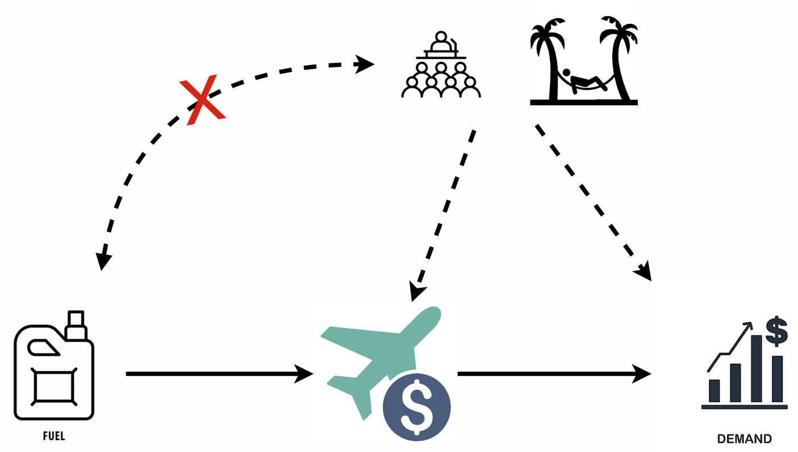
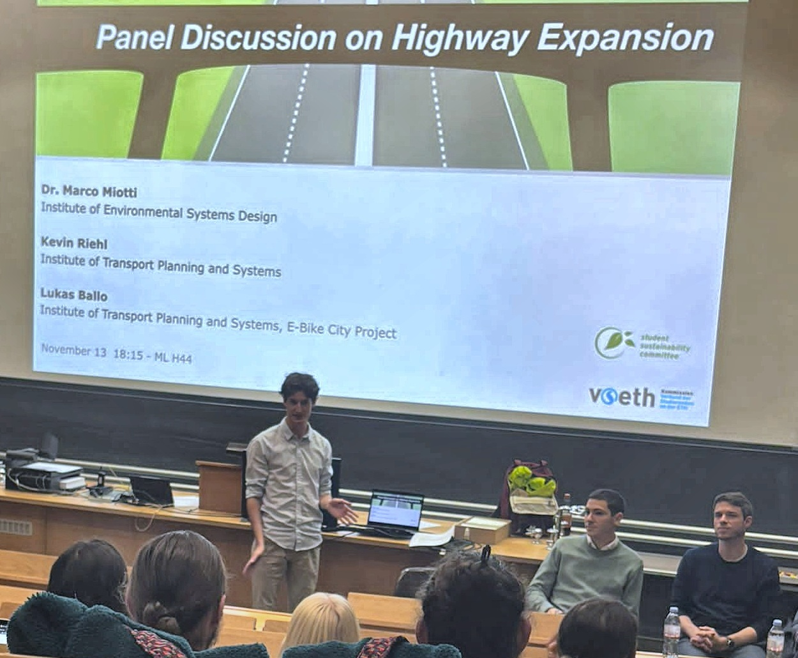
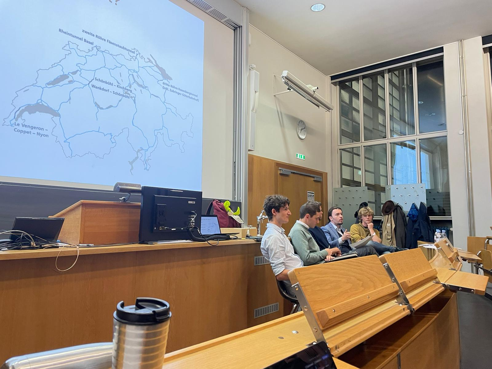
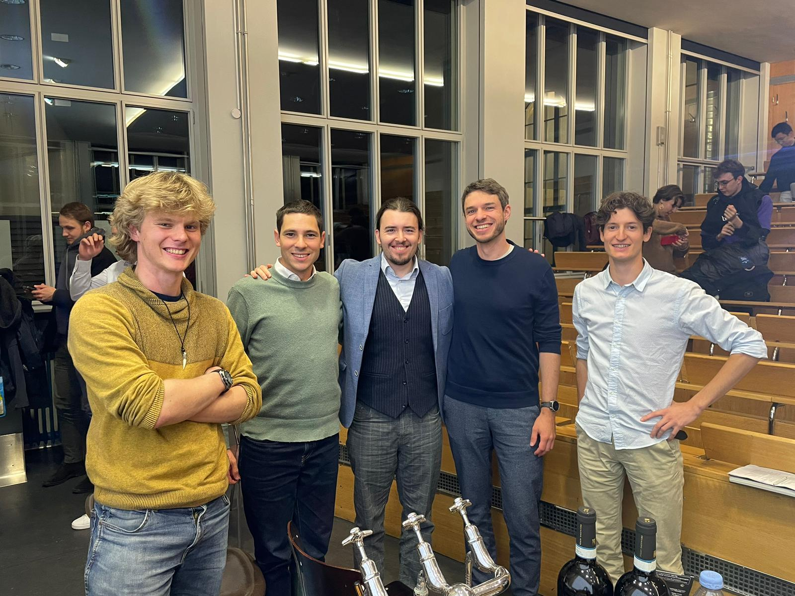

<!--
  This is your GitHub PROFILE README.
  To make it show on your profile page:
  1. Create a new repository named EXACTLY the same as your username
     (e.g. if you are github.com/janedoe, name the repo "janedoe").
  2. Make it public and add a README.md.
  3. Paste this content in and fill the [brackets].

  Images/videos: create an "assets/" folder in that repo, upload your
  photos/videos there, and reference them with a relative path like
  ./assets/tennis.jpg  (see notes near each section below).
-->

# Hi, I'm Samuel 👋

I grew up in the canton of Neuchâtel in Switzerland, where I enjoyed playing tennis from a young age. I then moved to the German-speaking part of Switzerland, to Zürich, for my Bachelor's and Master's at ETH Zürich, where I discovered the world of mathematics and became proficient in German (and, of course, English)! After my Master's, I spent a year as a research assistant at SCAI Lab, then chose to move into industry, working for an NGO (WWF Switzerland) as a Marketing Data Analyst for a year (internship, fixed-term contract). I have always felt close to nature and wanted to take this opportunity to discover what people are doing to help the planet. I feel lucky to have had this once-in-a-lifetime experience.

My work centers on causality, data science, and machine learning. I'm increasingly expanding into other areas to round out my data science profile, such as Docker and CI/CD. To see some of my projects, take a look below, and feel free to reach out!

---

## About Me

- 🔭 I'm currently doing data science for WWF Switzerland 🐼.
- 🌱 I'm currently learning docker, threading and multiprocessing in Python, and LLMs.
- 🎯 My focus areas are causality, Machine learning and data science.
- 💬 Ask me about real-life applications of causality.
- ⚡ Fun fact: My favorite animal is turtles and I have two.

<!-- Keep this to 4–6 short lines. Recruiters skim. -->

---

## Tech & Tools

**Languages**

  

**Libraries**

     

**Tools & Platforms**

    

<!--
  Optional: replace the text lists above with badges for a more visual look.
  Example (from https://shields.io — pick your own colors):
  
  
  Text lists are cleaner and easier to maintain; badges are more eye-catching.
-->

---

## Projects

### Master's Thesis on Instrumental Variables in Causal Inference

Instrumental variables (fuel price) are a method to correct for unobserved confounders (holidays, conferences) and estimate the true causal effect between a cause (airline ticket prices) and an effect (airline ticket demand). See the image below, that shows the causal graph between the variables in paranthesis.

I reviewed the literature and focused on the problem where the causal effect is nonlinear. Here, the distinction between the Two-Stage Least Squares and Control Function methods becomes apparent: the former allows slightly looser assumptions, while the latter is more powerful under some stronger independence assumptions, especially with a nonlinear causal effect. I then developed an algorithm I called Deep Control Function, which combines a deep neural network with the control function method. Finally, I ran a benchmark analysis comparing the state-of-the-art methods, challenging them on different simulated datasets with varying assumptions. I achieved the top grade, 6/6.

For more details:
🔗 **[View repository »](https://github.com/SamuelJoray/Master-Thesis)**
<!--[Optional: 🌐 [Live demo »](https://your-demo-link.com)]-->

<!-- A screenshot makes any project 10x more appealing: -->

  

<!---->

---

### [Project Name] — showcase only
[Describe a project you can't or don't want to open-source — coursework, client
work, a hardware build, etc. A photo is perfect here since there's no repo to link.]

**Stack:** [languages / tools used]
**My role:** [what you personally built or contributed]

---

<!-- Add more projects by copying either block above. Aim for 3–5 of your best. -->

---

## Beyond Code

### 🎤 Public Speaking
Co-moderated a panel discussion on the highway-expansion referendum in Switzerland. We invited three mobility experts from ETH Zürich for an enlightening, balanced discussion on the topic. Check this 

  

<!--
  ADDING A VIDEO (e.g. of your presentation):
  GitHub does NOT play videos referenced with the  image syntax.
  Two options that DO work:

  Option A (native player, recommended):
    Edit this README directly on github.com, then DRAG-AND-DROP your .mp4
    into the editor. GitHub uploads it and inserts a link like
    https://github.com/user/repo/assets/xxxx/yyyy that renders as a real
    video player. (Max ~100 MB, .mp4/.mov/.webm.)

  Option B (thumbnail that links out to YouTube/Vimeo):
    
    The image shows, and clicking it opens the video.
-->

### Windsurfing
I got into it this summer — still a beginner, though.

### 🎾 Tennis
Playing since I was four and still get a lot of pleasure out of practicing it.

<!---->

### ⛷️ Skiing
I've loved carving short turns ever since I bought slalom skis four years ago.

<!---->

<!--
  Optional GitHub stats card (auto-generated, updates itself):
  
  Nice-to-have, not essential. Skip if you prefer a cleaner look.
-->
